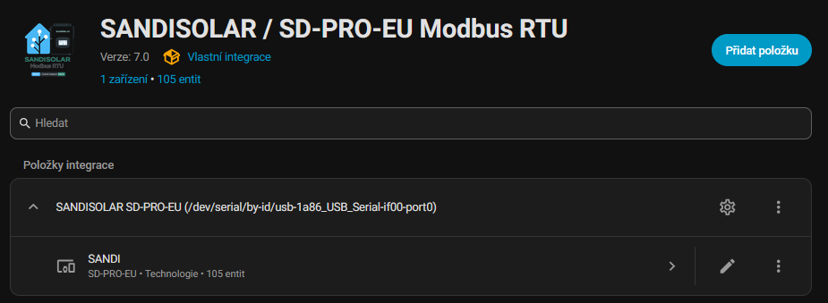
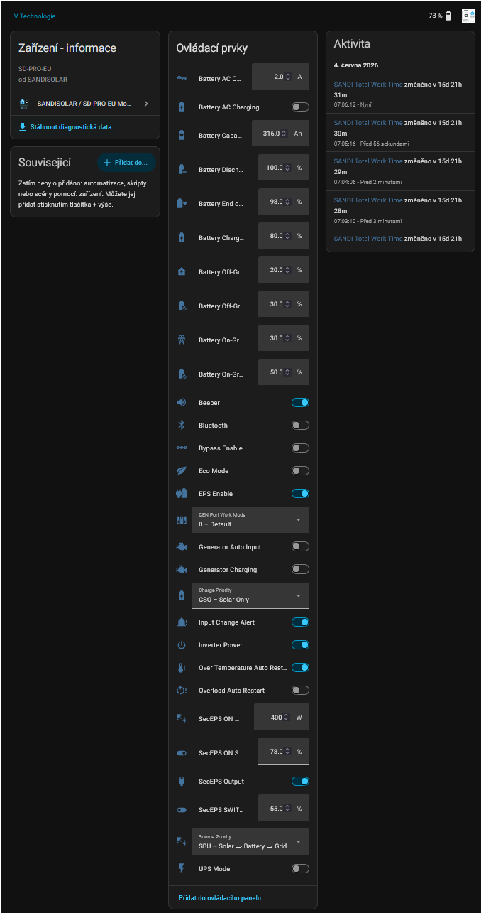
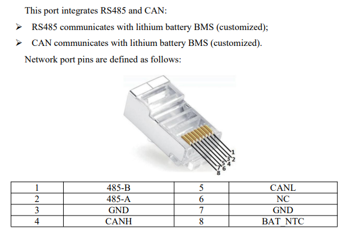
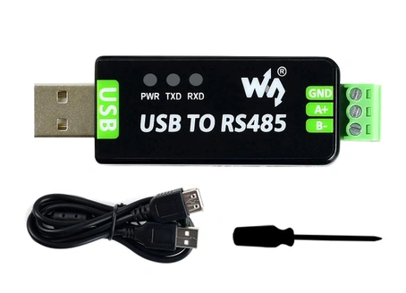

# ⚡ SANDISOLAR / SD-PRO-EU – Modbus RTU Integration for Home Assistant

Hybrid inverter **SANDISOLAR SD-PRO-EU** in Home Assistant without cloud dependency, using **Modbus RTU over RS485**.

Native Home Assistant integration for the **SANDISOLAR SD-PRO-EU Hybrid Inverter** using **Modbus RTU over RS485**.

It allows you to monitor solar production, battery state, grid data, EPS output, temperatures, warnings, fault states and energy counters. It also allows selected inverter functions to be controlled directly from Home Assistant.

> ⚠️ This integration communicates directly with the inverter. Advanced options may change inverter behavior. Do not click every shiny button just because it exists.

---

## ✨ Main Features

### 📊 Monitoring

- PV1 / PV2 voltage and current
- Total PV power
- Battery voltage, current, SOC, SOH and temperature
- Battery charge / discharge power
- Grid voltage, current, frequency and import/export power
- EPS voltage, current, active power and apparent power
- Inverter temperatures: base, boost, LLC and ambient
- Inverter status, battery status, fault codes and warning codes

### ⚡ Energy Counters

- PV Energy Today / Total
- Battery Charge / Discharge Energy Today / Total
- Grid Import / Export Energy Today / Total
- EPS Energy Today / Total
- Energy Sold / Bought Today / Total
- Self To Load Energy Today / Total

### 🧮 Calculated Sensors

- AVG PV Power
- AVG Battery Power
  - positive value = battery is charging
  - negative value = battery is discharging
- AVG Grid Power
- AVG EPS Load
- Battery SOC Real
- Battery SOC Speed
- Battery Power Speed
- Battery Charge ETA
- EPS Energy Hour

Averaged values are useful for more stable automations, PV surplus control, water heater control, EMHASS and dashboards.

---

## 🔋 Battery FCC / RM Fallback

Some BMS systems do not report **FCC** or **RM** values over Modbus. This integration can calculate them from the manually configured battery capacity.

Battery FCC = Battery Capacity Manual × Battery SOH / 100

If SOH is not available:

Battery FCC = Battery Capacity Manual

If the BMS does not report RM:

Battery RM = Battery FCC × Battery SOC / 100

This keeps battery-related calculations usable even with BMS systems that do not expose complete capacity data.

---

## ⏱️ Battery Charge ETA

The integration estimates when the battery will reach the configured **Battery End of Charge SOC**.

Possible states:

- `Will be full at 14:35`
- `Not today`
- `Was full at 13:02`

ETA uses hysteresis, so after reaching the target SOC it does not start showing nonsense when the battery slightly drops.

---

## ⚙️ Control and Settings

### 🔘 Switch

- Inverter Power
- EPS Enable
- Bypass Enable
- UPS Mode
- Battery AC Charging
- Generator Charging
- Beeper
- Bluetooth

### 🔢 Number

- Battery Charge Limit
- Battery Discharge Limit
- Battery End of Charge SOC
- On-Grid / Off-Grid Discharge SOC
- On-Grid / Off-Grid Recovery SOC
- AC Charge Current Limit
- Battery Capacity Manual
- SecEPS ON SOC
- SecEPS SWITCH SOC
- SecEPS ON PV Power Min

Number entities use direct numeric input instead of sliders. Precise settings deserve better than “drag and pray”.

### 🎛️ Select

- Source Priority
- Charge Priority
- GEN Port Work Mode
- AC Input Type / advanced mode

---

## 🧰 Advanced and Diagnostic Entities

Some options are marked as advanced or diagnostic and may be disabled by default:

- ADV - Island Mode
- ADV - Grid Feedback
- ADV - Split Phase Output
- ADV - Overload To Bypass
- ADV - Fast MPPT
- ADV - Zero Power Output
- ADV - Active Overload Enable
- ADV - DRMS Enable
- ADV - VFRT Enable
- ADV - AC Input Type

Diagnostics include:

- Inverter Status
- Battery Status
- Fault Code Decoder
- Warning Main / Sub Code
- Warning Main / Sub Text
- Total Work Time
- Raw / unknown select value handling

Unknown values are shown as raw values where possible, making firmware differences easier to troubleshoot.

---

## 🌍 Translations

The integration supports translated states, warnings and faults based on the Home Assistant language setting.

Currently included languages:

- English
- Czech
- German
- Polish
- Slovak

Main translated values:

- Inverter Status
- Battery Status
- Fault Code Decoder
- Warning Main Text
- Warning Sub Text
- Battery Charge ETA

If the selected language is not available, English is used as fallback.

---

## 🖼️ Screenshots

### 📊 Dashboard overview

### 🧩 Device page

### 🔌 RS485 / CAN port

### 🔗 USB-RS485 adapter

---

## 📋 Supported Entity Types

| Platform | Examples |
| --- | --- |
| Sensor | PV power, battery SOC, grid power, EPS power, temperatures, energy counters |
| Number | Charge limit, discharge limit, SOC limits, battery capacity manual |
| Switch | Inverter power, EPS, bypass, UPS mode, AC charging, generator charging |
| Select | Source priority, charge priority, GEN port work mode, AC input type |
| Diagnostic | Fault codes, warnings, inverter status, battery status |
| Calculated | AVG PV Power, AVG Battery Power, AVG Grid Power, AVG EPS Load, Battery Charge ETA |

---

## 📦 Installation via HACS

1. Open **HACS**
2. Select **Integrations**
3. Click **⋮ → Custom repositories**
4. Add repository: `https://github.com/vsajer/sandisolar-ha`
5. Category: `Integration`
6. Install the integration
7. Restart Home Assistant
8. Add the integration in **Settings → Devices & Services → Add Integration**
9. Select **SANDISOLAR Modbus RTU**

---

## ⚙️ Configuration

| Parameter | Example |
| --- | --- |
| Serial Port | `/dev/ttyUSB0` |
| Baud Rate | `9600` |
| Slave ID | `1` |
| Update Interval | `10 s` |

---

## 🔌 RS485 Wiring

| Inverter | USB-RS485 |
| --- | --- |
| A | A / D+ |
| B | B / D- |

Recommendations:

- use twisted pair cable
- use shielded cable for longer cable runs
- use a 120 Ω termination resistor on long RS485 lines
- keep only one Modbus master on a single RS485 bus

> ⚠️ Modbus RTU expects one master. The original WiFi logger and a Home Assistant RS485 adapter may cause communication conflicts if used at the same time.

If communication does not work, try swapping A/B wires on the USB-RS485 adapter. RS485 labeling is sometimes a lottery wearing work boots.

---

## ⚡ PV Surplus and Energy Optimization

The most useful sensors for PV surplus control and energy optimization are:

| Sensor | Purpose |
| --- | --- |
| AVG PV Power | Smoothed solar production |
| AVG Battery Power | Positive = charging, negative = discharging |
| AVG Grid Power | Smoothed grid import/export |
| AVG EPS Load | Smoothed EPS / house load |
| Battery SOC Real | Usable SOC based on configured limits |
| Battery Charge ETA | Estimated time to target charge level |

Typical use cases:

- water heater control based on PV surplus
- battery protection
- off-grid optimization
- zero-export logic
- EMHASS planning

---

## 🧩 Compatibility

Tested with:

- SANDISOLAR SD-PRO-EU 6.5K
- Modbus RTU Protocol V2.14
- Home Assistant 2025+

Firmware and Modbus maps may differ between models. For this reason, the integration handles some registers carefully and tries to expose raw values for unknown states.

---

## 🛠️ Troubleshooting

### ❌ Integration does not connect

Check:

- correct serial port, for example `/dev/ttyUSB0`
- correct baud rate, usually `9600`
- correct slave ID, usually `1`
- RS485 A/B wiring
- USB-RS485 adapter permissions
- that there is no second Modbus master on the RS485 bus

### ⚠️ Values are unavailable

Try:

- restart Home Assistant
- check Modbus wiring
- swap A/B wires
- lower the update interval
- temporarily disconnect the original WiFi logger

### 📱 Original inverter app stopped showing live data

The original WiFi logger and RS485 adapter may fight over communication.

Try:

1. Disable the Home Assistant integration
2. Disconnect the USB-RS485 adapter
3. Restart the inverter / WiFi logger
4. Wait several minutes
5. Check the original app again

### 🎛️ GEN Port Work Mode shows unknown value

Some firmware versions may return undocumented values. The integration displays them as raw / unknown values where possible, so they can be investigated and added later.

### 🔋 Battery FCC / RM shows calculated values

If the BMS does not report FCC or RM, the integration calculates them from:

- Battery Capacity Manual
- Battery SOH
- Battery SOC

This is expected behavior.

---

## 📝 Notes

The integration is still evolving. Some advanced functions are based on available Modbus documentation and observed inverter behavior.

When reporting an issue, please include:

- inverter model
- firmware version
- Modbus protocol version, if known
- relevant Home Assistant logs
- raw register values, if available

---

## 📄 License

This project is licensed under the MIT License.

---

## 👨‍💻 Author

**Vláďa (@vsajer)**  
Czech Republic 🇨🇿

---

## ❤️ Support

If this integration helped you:

- ⭐ Star the repository
- 🐞 Report issues
- 🖼️ Share screenshots and test results
- 🧩 Contribute register definitions
- 🌍 Improve translations and documentation

Pull requests are welcome.
